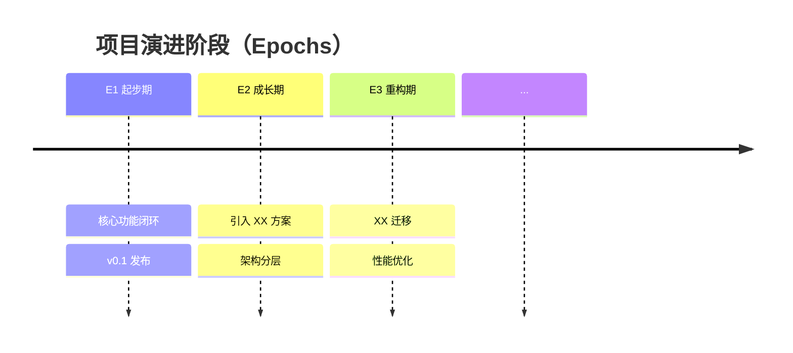

# 代码考古演进分析文档模板

> 输出语言：中文为主，技术术语中英对照
> 视角：解决方案工程师 + 架构师（演进复盘视角）
> 组织方式：**时间驱动**（先分期，后逐期分析方案演化）
> 必须给出：证据标注、commit hash、Mermaid 时间线与架构快照

---

## 0. 仓库画像（Repo Profile）

### 0.1 基本信息

| 项目 | 信息 |
|------|------|
| 仓库名称 | |
| 仓库路径 | |
| 项目类型 | 前端/后端/全栈/SDK/CLI/基础设施/Monorepo |
| 一句话定位 | 这个项目是什么？核心价值是什么？ |
| 主要语言 | |
| 核心框架 | |
| 当前代码规模 | 文件数 / 代码行数 |
| 分析日期 | |

### 0.2 历史统计

| 指标 | 数值 |
|------|------|
| 首次提交 | <hash> (<date>) |
| 最近提交 | <hash> (<date>) |
| 项目寿命 | X 年 Y 月 |
| 总 commit 数 | |
| 贡献者数 | |
| Tag/Release 数 | |
| PR 数（如可获取） | |

### 0.3 当前技术栈

| 分类 | 技术选型 | 引入时期 |
|------|---------|---------|
| 语言/运行时 | | E? |
| 核心框架 | | E? |
| 数据存储 | | E? |
| 缓存 | | E? |
| 消息/队列 | | E? |
| 认证/安全 | | E? |
| 测试 | | E? |
| 构建/部署 | | E? |

### 0.4 开发节奏概览

**Mermaid — 月度提交分布**：

```mermaid
gantt
    title 项目开发节奏
    dateFormat YYYY-MM
    ...
```

### 0.5 贡献者画像

| 排名 | 贡献者 | commit 数 | 主要贡献领域 | 活跃期 |
|------|--------|----------|------------|--------|
| 1 | ... | ... | ... | ... |
| 2 | ... | ... | ... | ... |

---

## 1. 演进时间线（Evolution Timeline）

### 1.1 演进分期总览

**Mermaid — 演进时间线**：



### 1.2 演进分期表

| Epoch | 名称 | 时间范围 | 主题 | 关键信号 | commit 范围 |
|-------|------|---------|------|---------|------------|
| E1 | 最小可行版本 | YYYY-MM ~ YYYY-MM | ... | ... | <hash>..<hash> |
| E2 | ... | ... | ... | ... | ... |
| E3 | ... | ... | ... | ... | ... |
| ... | ... | ... | ... | ... | ... |

### 1.3 "核心矛盾"演化链

> 每个阶段的**核心矛盾**是什么？它如何驱动系统进入下一个阶段？

```
E1 核心矛盾：如何最快验证可行性 → 快速实现 MVP
    ↓ MVP 验证通过，但代码不可维护
E2 核心矛盾：如何在不停机的情况下引入架构 → 渐进式重构
    ↓ 架构基本成型，但性能成为瓶颈
E3 核心矛盾：如何优化性能且不破坏现有功能 → 引入缓存 + 异步
    ↓ ...
```

---

## 2. 逐阶段深度分析

> **文档主体部分**：对每个 Epoch 进行详细的方案演进分析。

---

### 2.1 Epoch 1：[名称]（YYYY-MM ~ YYYY-MM）

#### 阶段主题

> 这个阶段系统在做什么？核心矛盾是什么？

#### 架构快照

**Mermaid — E1 架构状态**：


**目录结构**（`git ls-tree` 还原）：
```
当时的目录结构...
```

**技术栈**：

| 分类 | 选型 | 状态 |
|------|------|------|
| ... | ... | 首次引入/延续/替换 |

#### 关键 commit 考古

**考古卡片 K1**：

| 字段 | 内容 |
|------|------|
| Commit | `<hash>` (`<date>`) |
| Author | ... |
| Message | ... |
| 类型 | 新方案/重构/迁移/修复/工程化 |
| What Changed | ... `[证据]` |
| Why | ... `[证据/推断]` |
| Trade-off | ... `[推断]` |
| Impact | ... `[推断]` |
| Follow-ups | ... `[证据]` |

**考古卡片 K2**：
（同上格式）

#### 方案引入/演化

| 方案 | 初始形态 | 本阶段变化 | 驱动力 |
|------|---------|-----------|--------|
| ... | ... | ... | ... |

#### PR 分析（如可用）

| PR # | 标题 | 类别 | 方案意义 | 实施策略 |
|------|------|------|---------|---------|
| #N | ... | Feature/Refactor/Fix | ... | 一步到位/渐进式 |

#### 阶段总结

- **成果**：这个阶段完成了什么？
- **遗产**：留给下个阶段什么基础？
- **债务**：留下了什么技术债务？
- **转折信号**：什么推动了进入下一阶段？

---

### 2.2 Epoch 2：[名称]（YYYY-MM ~ YYYY-MM）

（同上结构）

---

### 2.3 Epoch 3：[名称]（YYYY-MM ~ YYYY-MM）

（同上结构）

---

（以此类推，覆盖 E1..En 所有阶段）

---

## 3. 方案迭代追踪（Solution Evolution Tracking）

> 选取 3-5 个**核心方案**，追踪其完整的演化路径。

### 3.1 方案 A：[方案名称]（如：认证方案）

#### 演化时间线

```
E1: [初始形态] — 描述 [证据: commit]
E3: [第一次重构] — 描述 [证据: PR/commit]
E5: [成熟形态] — 描述 [证据: commit]
E7: [再演化] — 描述 [证据: commit]（如有）
```

#### 演化 Mermaid 图


#### 每次演化的动机与取舍

| 演化节点 | 驱动力 | 选择 | 放弃 | 代价 |
|---------|--------|------|------|------|
| E1→E3 | ... | ... | ... | ... |
| E3→E5 | ... | ... | ... | ... |

#### 方案成熟度评价

| 维度 | 评价 |
|------|------|
| 当前完成度 | ... |
| 演进合理性 | 每步迭代是否有必要？节奏是否合理？ |
| 最关键的一次迭代 | 哪次变化最有价值？为什么？ |

---

### 3.2 方案 B：[方案名称]

（同上结构）

---

### 3.3 方案 C：[方案名称]

（同上结构）

---

## 4. 关键决策清单（Decision Registry）

### 4.1 决策总览

| 编号 | 决策内容 | Epoch | 日期 | 类型 | 影响 | 证据 |
|------|---------|-------|------|------|------|------|
| D1 | 选择 X 框架 | E1 | ... | 技术选型 | 架构基础 | commit |
| D2 | 引入 Y 中间件 | E2 | ... | 方案引入 | 性能提升 | PR |
| D3 | 从 A 迁移到 B | E4 | ... | 技术迁移 | 可维护性 | PR + diff |
| ... | ... | ... | ... | ... | ... | ... |

### 4.2 重点决策深度分析

#### D1：[决策内容]

| 字段 | 内容 |
|------|------|
| 决策时机 | `<commit>` (`<date>`) — Epoch E? |
| 决策者 | ... |
| 驱动力 | ... `[证据/推断]` |
| 选择 | ... |
| 被放弃的选项 | ... `[推断]` |
| 权衡 | 获得了什么 / 付出了什么 |
| 后续影响 | 后来是否补充/修正/回滚？ |
| 代码证据 | commit / 文件路径 / diff 片段 |

#### D2：[决策内容]

（同上格式）

---

## 5. 架构演化对比（Architecture Comparison）

### 5.1 v0 → 当前态 对比

| 维度 | v0（首次提交时） | 当前态 | 差异解读 |
|------|----------------|--------|---------|
| 目录层级 | ... | ... | ... |
| 核心抽象 | ... | ... | ... |
| 数据存储 | ... | ... | ... |
| API 设计 | ... | ... | ... |
| 部署方式 | ... | ... | ... |
| 测试覆盖 | ... | ... | ... |
| 依赖数量 | ... | ... | ... |

### 5.2 架构快照并排对比

**Mermaid — v0 架构**：


**Mermaid — 重大重构后架构**：


**Mermaid — 当前架构**：


### 5.3 架构变化的核心洞察

> 架构从 v0 到现在，最根本的变化是什么？

- **最大的结构性变化**：...
- **最有价值的演进决策**：...
- **最昂贵的技术债务**：...
- **架构的演进模式**：先跑通 → 抽象化 → 工程化 → 性能化 → ?

---

## 6. 技术债务时间线（Tech Debt Timeline）

### 6.1 识别到的技术债务

| 编号 | 债务描述 | 引入阶段 | 识别阶段 | 清偿阶段 | 状态 | 累积成本 |
|------|---------|---------|---------|---------|------|---------|
| TD1 | ... | E1 | E3 | E5 | 已清偿 | 中等 |
| TD2 | ... | E2 | - | - | 当前仍存在 | 高 |

### 6.2 债务模式分析

> 这个项目的技术债务有什么规律？

- **债务引入模式**：快速实现 / 跳过测试 / 临时方案 / 过度设计
- **清偿节奏**：定期还债 / 积累后集中重构 / 从不还债
- **未清偿债务风险**：...

---

## 7. PR 全景分析（如可用）

### 7.1 PR 分类统计

| PR 类别 | 数量 | 占比 | 趋势 |
|---------|------|------|------|
| Feature | ... | ...% | 早期多/后期少/稳定 |
| Refactor | ... | ...% | ... |
| Fix | ... | ...% | ... |
| Infra | ... | ...% | ... |
| Dependency | ... | ...% | ... |
| Breaking | ... | ...% | ... |

### 7.2 高价值 PR 深度分析

#### PR #N：[标题]

| 字段 | 内容 |
|------|------|
| 状态 | merged/open/closed |
| 作者 | ... |
| 日期 | ... |
| Epoch | E? |
| 方案意义 | 引入了什么方案 / 重构了什么 / 修复了什么 |
| 实施策略 | 一步到位 / 渐进式（几个 commit） |
| 变更范围 | 涉及哪些模块/文件 |
| 影响评估 | 对架构/性能/可维护性的影响 |

（列出 Top 10-20 高价值 PR）

---

## 8. 演进叙事（Evolution Narrative）

> **串联章**：把前面的分析串成一条有因果逻辑的演进故事。

### 8.1 演进主线故事

> 一条从起点到当前的完整叙事线，包含所有转折点。

"这个项目始于 YYYY-MM，最初的目标是……

第一个阶段（E1），团队的核心矛盾是……，因此选择了……方案。这个选择的直接后果是……

随着……（驱动力），系统进入了 E2 阶段。这个阶段的标志性事件是……（commit/PR 证据）。决策者面临的权衡是……

转折点出现在 E3，当……（信号），团队意识到需要……。这次重构分 N 个 PR 渐进完成：……

当前（En），系统的架构态势是……，面临的下一个挑战可能是……"

### 8.2 转折点高亮

| 转折点 | 时间 | 事件 | 之前 → 之后 | 影响 |
|--------|------|------|------------|------|
| T1 | ... | ... | ... | ... |
| T2 | ... | ... | ... | ... |

### 8.3 踩坑记录

> 从 revert/hotfix/反复修改 中识别出的"坑"。

| 编号 | 坑描述 | 首次踩坑 | 修复 | 代码证据 | 教训 |
|------|--------|---------|------|---------|------|
| P1 | ... | commit | commit | ... | ... |

---

## 9. 总评与展望

### 9.1 演进质量评估

| 维度 | 评分（1-5★） | 依据 |
|------|-------------|------|
| 演进节奏 | ★★★☆☆ | 重构是否及时/过早/过晚？ |
| 决策质量 | ★★★☆☆ | 关键选择是否合理？ |
| 债务管理 | ★★★☆☆ | 技术债务是否可控？ |
| 架构演化 | ★★★☆☆ | 架构是否在正确的方向演进？ |
| 工程化成熟度 | ★★★☆☆ | CI/CD/测试/监控的引入节奏 |

### 9.2 演进模式总结

> 这个项目的演进，遵循了什么模式？

- [ ] 先跑通 → 抽象化 → 工程化 → 性能化 → 平台化
- [ ] 持续渐进式改进（小步快跑）
- [ ] 长期积累 → 集中重构（大爆炸式）
- [ ] 需求驱动（有需求才改）
- [ ] 技术驱动（追新技术）
- [ ] 其他：...

### 9.3 未来演进方向预判

> 基于当前架构态势和技术债务，系统可能的演进方向：

| 方向 | 可能性 | 依据 | 建议 |
|------|--------|------|------|
| ... | 高/中/低 | ... | ... |

### 9.4 一句话总评

> 对这个项目的技术演进给出一句话总结评价。

---

## 附录 A：关键提交索引

| 编号 | Commit | 日期 | 作者 | 类型 | 一句话摘要 | Epoch |
|------|--------|------|------|------|-----------|-------|
| K1 | `<hash>` | ... | ... | ... | ... | E? |
| K2 | `<hash>` | ... | ... | ... | ... | E? |

## 附录 B：决策清单

| 编号 | 决策 | 日期 | Epoch | 类型 | 证据 |
|------|------|------|-------|------|------|
| D1 | ... | ... | E? | ... | commit/PR |

## 附录 C：Mermaid 图索引

| 图编号 | 标题 | 类型 | 所在章节 |
|--------|------|------|---------|
| Fig-01 | 演进时间线 | timeline | 1.1 |
| Fig-02 | E1 架构快照 | graph | 2.1 |
| Fig-03 | E2 架构快照 | graph | 2.2 |
| ... | ... | ... | ... |

## 附录 D：可复现命令清单

> 用于验证/复现本文档中分析结论的 Git 命令。

```bash
# 1. 项目概览
git log --oneline | wc -l
git shortlog -sn --no-merges

# 2. 分期相关
git tag --sort=creatordate
git log --format="%Y-%m" | sort | uniq -c

# 3. 关键提交查验
git show <commit> --stat
git show <commit>:<file>

# 4. diff 查验
git diff <epoch_start>..<epoch_end> --stat

# 5. blame 查验
git blame <file>
```

## 附录 E：技术栈变迁矩阵

| 技术 | E1 | E2 | E3 | E4 | 当前 | 变迁说明 |
|------|----|----|----|----|------|---------|
| 框架 A | ✅ | ✅ | ❌ | ❌ | ❌ | E3 被框架 B 替代 |
| 框架 B | ❌ | ❌ | ✅ | ✅ | ✅ | E3 引入 |
| 缓存 Redis | ❌ | ❌ | ❌ | ✅ | ✅ | E4 引入 |

---

## 文档统计

| 指标 | 值 |
|------|-----|
| Epoch 数量 | |
| 关键提交数量 | |
| 决策卡片数量 | |
| Mermaid 图数 | |
| 方案迭代追踪数 | |
| 分析日期 | |
