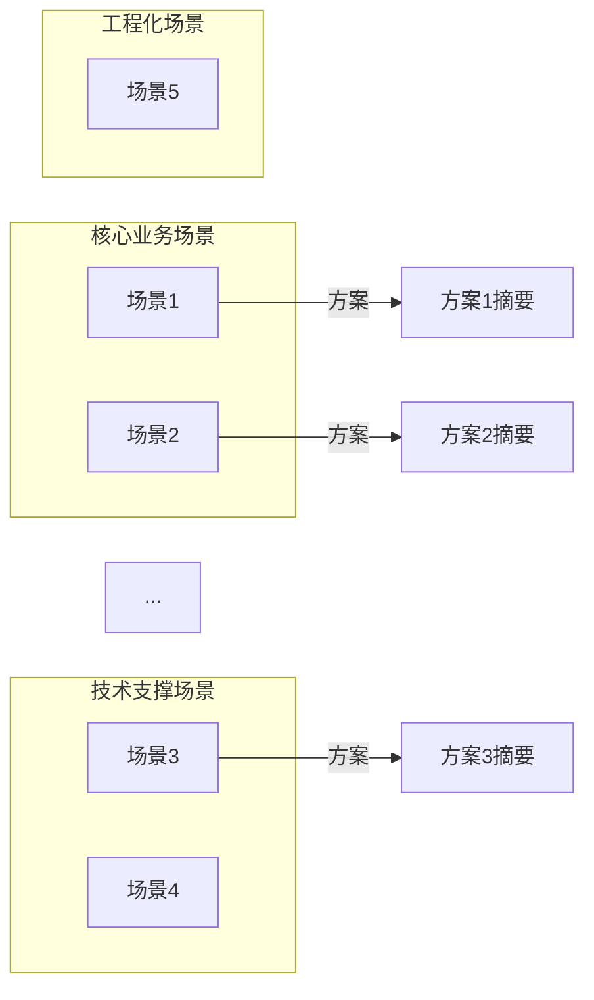
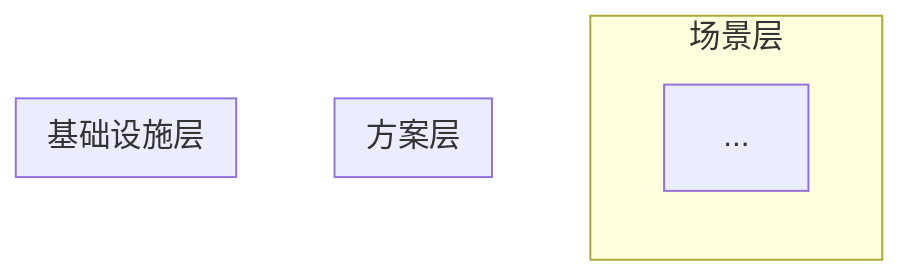

# 技术方案逆向分析文档模板

> 输出语言：中文为主，技术术语中英对照
> 视角：解决方案工程师 + 架构师
> 组织方式：**场景驱动**（先提炼场景，再逐场景分析方案）
> 必须给出：分析日期、仓库路径、技术栈、Mermaid 图

---

## 0. 项目概览

### 0.1 基本信息

| 项目 | 信息 |
|------|------|
| 仓库名称 | |
| 仓库路径 | |
| 项目类型 | 前端/后端/全栈/SDK/CLI/基础设施/Monorepo |
| 一句话定位 | 这个项目是什么？核心价值是什么？ |
| 主要语言 | |
| 核心框架 | |
| 代码规模 | 文件数 / 代码行数 |
| 分析日期 | |

### 0.2 技术栈全景

| 分类 | 技术选型 | 在系统中的角色 |
|------|---------|--------------|
| 语言/运行时 | | |
| 核心框架 | | |
| 数据存储 | | |
| 缓存 | | |
| 消息/队列 | | |
| 认证/安全 | | |
| 测试 | | |
| 构建/部署 | | |

### 0.3 系统能力概述

> 系统对外提供了什么能力？用一段话描述。

### 0.4 推断与假设清单

| 编号 | 推断内容 | 可信度 | 依据 |
|------|---------|--------|------|
| A1 | ... | 高/中/低 | 代码证据/README/合理推断 |

---

## 1. 场景全景图

### 1.1 场景提炼总览

> 从代码中识别的所有核心场景/技术挑战。

| 编号 | 场景名称 | 分类 | 重要度 | 对应代码区域 | 方案关键词 |
|------|---------|------|--------|------------|-----------|
| S1 | ... | 核心业务/数据/通信/安全/可靠性/性能/扩展/工程 | 🔴/🟡/🟢 | ... | ... |
| S2 | ... | ... | ... | ... | ... |
| S3 | ... | ... | ... | ... | ... |
| ... | ... | ... | ... | ... | ... |

### 1.2 场景-方案映射图

**Mermaid — 场景-方案全景映射**：



### 1.3 场景间依赖关系

> 哪些场景之间存在依赖？哪些共享基础设施？

---

## 2. 核心场景方案深度分析

> **文档主体部分**：对每个场景逐一进行 8 维度方案分析。
> 按重要度排序：🔴 核心场景优先。

---

### 2.1 场景 S1：[场景名称]

#### ① 问题定义

**场景描述**：
> 系统在这个场景下面临什么问题？有什么约束和挑战？

**核心挑战**：
- 挑战 1：...
- 挑战 2：...
- 挑战 3：...

**约束条件**：
- ...

#### ② 方案概述

> **一句话方案**：采用 [核心技术/模式]，通过 [关键机制]，解决 [核心问题]。

**方案技术栈**：

| 组件 | 技术 | 角色 |
|------|------|------|
| ... | ... | ... |

#### ③ 方案架构

**Mermaid — S1 方案架构图**：


**架构解读**：
> 各组件如何协作？数据如何流转？为什么这样分层/分模块？

**Mermaid — S1 核心流程时序图**：

```mermaid
sequenceDiagram
    ...
```

**流程解读**：
> 正常路径的完整流程。关键节点在哪里？数据在哪些节点发生转换？

#### ④ 关键设计决策

**决策 1**：[选择了什么]
- 为什么选这个：...
- 为什么不选 [备选方案]：...
- 权衡了什么：...
- 代码证据：[路径]

**决策 2**：[选择了什么]
- 为什么选这个：...
- 为什么不选 [备选方案]：...
- 权衡了什么：...

**决策 3**（如有）：...

#### ⑤ 异常与边界处理

| 异常场景 | 处理策略 | 代码证据 | 评价 |
|---------|---------|---------|------|
| 超时 | ... | ... | 完备/部分/缺失 |
| 重试 | ... | ... | ... |
| 数据异常 | ... | ... | ... |
| 并发冲突 | ... | ... | ... |
| 降级/兜底 | ... | ... | ... |
| ... | ... | ... | ... |

#### ⑥ 方案评价

| 维度 | 评价 |
|------|------|
| **优势** | 这个方案做得好的地方 |
| **代价** | 为此付出了什么（复杂度/性能/学习成本/运维成本） |
| **适用边界** | 在什么规模/场景下最合适？什么时候可能不够用？ |
| **潜在风险** | 架构层面的隐患 |
| **完成度** | 方案是否完整落地，还是有未完成的部分？ |

#### ⑦ 替代方案对比

| 方案 | 核心思路 | 优势 | 劣势 | 适用场景 | 为什么项目没选 |
|------|---------|------|------|---------|--------------|
| 当前方案 | ... | ... | ... | ... | — |
| 替代方案 A | ... | ... | ... | ... | [推断] |
| 替代方案 B | ... | ... | ... | ... | [推断] |

#### ⑧ 可复用性评估

- **可复用的模式/思路**：...
- **迁移到其他项目需要什么**：...
- **复用时的注意事项**：...

---

### 2.2 场景 S2：[场景名称]

（同上 8 维度分析结构）

---

### 2.3 场景 S3：[场景名称]

（同上 8 维度分析结构）

---

（以此类推，覆盖 S1..Sn 所有核心场景）

---

## 3. 方案间关联与整体架构

### 3.1 整体架构还原

**Mermaid — 从场景方案反推的整体架构图**：



**架构风格推断**：
> 综合所有场景方案，系统的整体架构风格是什么？为什么？

### 3.2 方案协作关系

| 方案 A | 方案 B | 关系类型 | 说明 |
|--------|--------|---------|------|
| S1 方案 | S3 方案 | 数据依赖 / 共享基础设施 / 时序依赖 | ... |
| ... | ... | ... | ... |

**Mermaid — 方案间协作图**：


### 3.3 架构一致性评估

| 评估维度 | 状况 | 说明 |
|---------|------|------|
| 设计风格一致性 | 一致/部分一致/不一致 | ... |
| 错误处理统一性 | ... | ... |
| 数据访问模式统一性 | ... | ... |
| 命名/约定一致性 | ... | ... |

### 3.4 设计哲学推断

> 综合所有场景方案，推断架构师的核心设计哲学：

- **优先优化什么**：可维护性 / 性能 / 可扩展性 / 开发效率 / 可靠性？
- **愿意牺牲什么**：复杂度 / 极致性能 / 灵活性？
- **偏好的技术手段**：
- **最关注的质量属性**：

---

## 4. 横切方案分析

> 分析那些**跨多个场景的通用技术方案**。

### 4.1 错误处理方案

#### 问题
> 系统如何统一处理各类错误？

#### 方案
> ...

#### 评价
| 维度 | 评价 |
|------|------|
| 完整性 | ... |
| 一致性 | ... |
| 可维护性 | ... |

---

### 4.2 安全基线方案

（同上结构）

---

### 4.3 可观测性方案

（同上结构）

---

### 4.4 配置管理方案

（同上结构）

---

### 4.5 测试保障方案

（同上结构）

---

### 4.6 构建部署方案

（同上结构）

---

## 5. 方案质量总评

### 5.1 方案完成度矩阵

| 场景 | 正常路径 | 异常路径 | 文档/注释 | 测试覆盖 | 总体完成度 |
|------|---------|---------|----------|---------|-----------|
| S1 | ✅/⚠️/❌ | ✅/⚠️/❌ | ✅/⚠️/❌ | ✅/⚠️/❌ | 完整/基本/有缺失 |
| S2 | ... | ... | ... | ... | ... |

### 5.2 方案质量雷达

| 维度 | 评分（1-5★） | 依据 |
|------|-------------|------|
| 方案完整性 | ★★★☆☆ | ... |
| 方案优雅度 | ★★★☆☆ | ... |
| 方案一致性 | ★★★☆☆ | ... |
| 方案可复用性 | ★★★☆☆ | ... |
| 方案可演进性 | ★★★☆☆ | ... |

### 5.3 TOP 5 方案亮点

| 排名 | 场景 | 亮点 | 为什么值得学习 |
|------|------|------|--------------|
| 1 | S? | ... | ... |
| 2 | S? | ... | ... |
| 3 | S? | ... | ... |
| 4 | S? | ... | ... |
| 5 | S? | ... | ... |

### 5.4 改进建议

**P0 — 方案缺陷（必须修复）**：
1. [场景] — 问题 → 建议
2. ...

**P1 — 方案增强（应当改进）**：
1. [场景] — 问题 → 建议
2. ...

**P2 — 方案升级（长期演进方向）**：
1. [场景] — 方向 → 路径
2. ...

### 5.5 一句话总评

> 对整个系统的技术方案给出一句话总结评价。

---

## 附录 A：场景-方案速查表

| 场景编号 | 场景名称 | 核心方案 | 关键技术 | 评价 |
|---------|---------|---------|---------|------|
| S1 | ... | ... | ... | ✅/⚠️ |
| S2 | ... | ... | ... | ... |

## 附录 B：设计决策清单

| 编号 | 场景 | 决策 | 选择 | 取舍 | 代码证据 |
|------|------|------|------|------|---------|
| D1 | S1 | ... | ... | ... | ... |
| D2 | S2 | ... | ... | ... | ... |

## 附录 C：Mermaid 图索引

| 图编号 | 标题 | 类型 | 所在章节 |
|--------|------|------|---------|
| Fig-01 | 场景-方案全景映射 | graph | 1.2 |
| Fig-02 | S1 方案架构图 | graph | 2.1 |
| Fig-03 | S1 核心流程时序图 | sequenceDiagram | 2.1 |
| ... | ... | ... | ... |

## 附录 D：技术栈-场景关联矩阵

| 技术 | S1 | S2 | S3 | S4 | S5 | 角色 |
|------|----|----|----|----|----|----|
| 技术A | ✓ | | ✓ | | | 核心 |
| 技术B | | ✓ | | ✓ | | 辅助 |

---

## 文档统计

| 指标 | 值 |
|------|-----|
| 场景数量 | |
| 方案分析数量 | |
| 设计决策数量 | |
| Mermaid 图数 | |
| 分析日期 | |
