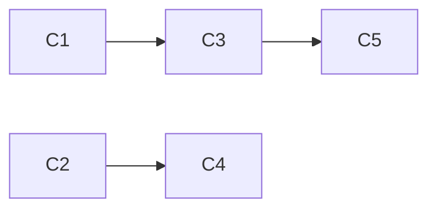
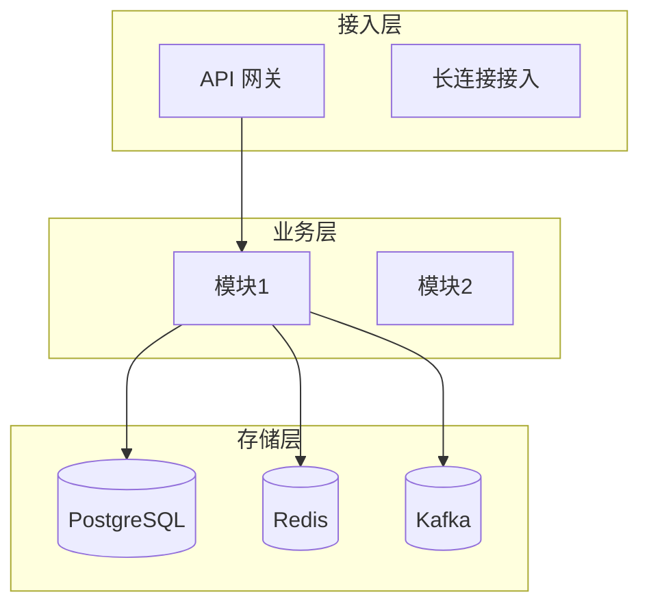
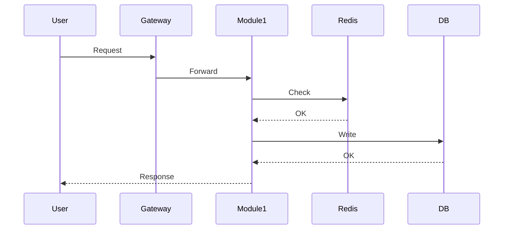
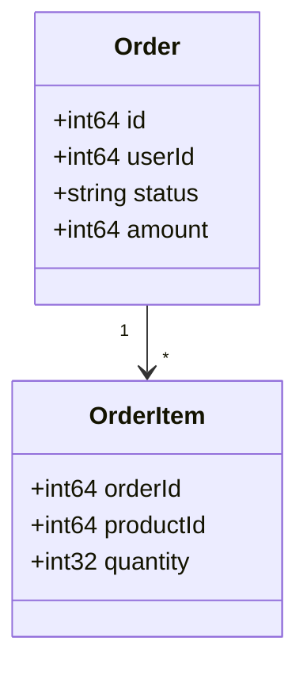
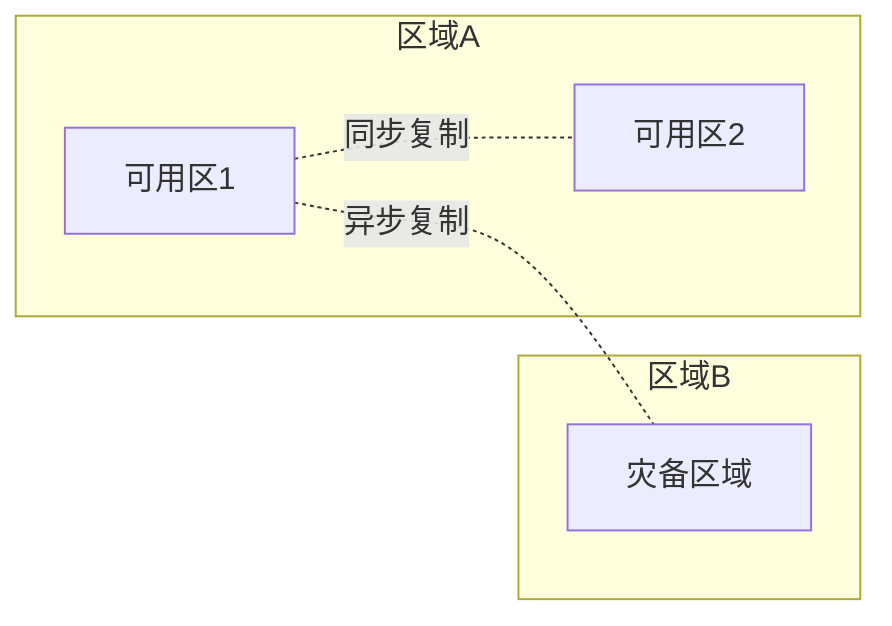
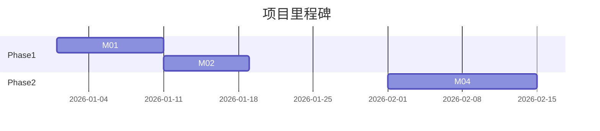

# 8 份核心文档的骨架模板

> 本文档提供 `research / business / scale-constraints / judgment / challenges / solutions / architecture / playbook` 八份核心文档的可填骨架。其中 `judgment.md` 是**判断型**文档,其余主要是分析/决策型文档。
> 使用方式:按当前场景把占位符(`{...}`)替换为具体内容,保留章节结构。
> 另外 `assumptions.md` 作为贯穿三个 Gate 的副产物,单独给一个模板在末尾。
>
> ⚠️ **注意**:本文件只给 `judgment.md` 的简版骨架。完整判断题库、反 AI 依赖规则与质量闸门见 `human-judgment-template.md`。本文件不含 `deep-dives/C{N}-*.md`(**教学型**深度拆解)的模板,那一类文档单独在 `deep-dive-template.md` 维护。

---

## 0. `research.md` 模板

```markdown
# {Scenario 名称} — 调研证据

> 文档定位:联网搜索的证据汇总,为后续分析提供事实基础。
> 本文档的内容会被 challenges.md、solutions.md、architecture.md 等引用。

---

## 1. 开源项目速查

| # | 项目名 | Stars | 语言 | 核心架构思路 | 与本场景关联度 | 关键 trade-off | URL |
|---|---------|-------|------|------------|--------------|--------------|-----|
| R-OS1 | {name} | {N}k | {lang} | {一句话} | 高/中/低 | {选了X放弃Y} | {url} |
| R-OS2 | ... | ... | ... | ... | ... | ... | ... |

### R-OS1. {project_name}

- **项目**: {name} ({url})
- **Stars**: {N} | **语言**: {lang} | **最近更新**: {date}
- **核心架构**: {一句话概述}
- **与本场景的关联**: {哪些子问题可以参考}
- **关键 trade-off**: {该项目选择了什么,放弃了什么}
- **对本项目的启示**: {可借鉴的具体做法}

### R-OS2. ...

---

## 2. 大厂方案摘要

| # | 公司 | 场景规模 | 核心方案 | 关键 trade-off | URL |
|---|------|---------|---------|--------------|-----|
| R-BT1 | {company} | {DAU/QPS} | {一句话} | ... | {url} |
| R-BT2 | ... | ... | ... | ... | ... |

### R-BT1. {company} — {title}

- **来源**: {company} - {title} ({url})
- **场景规模**: {DAU/QPS/数据量}
- **核心方案**: {一句话概述}
- **关键 trade-off**: {选择了什么,为什么}
- **可借鉴点**: {对本场景有价值的具体做法}

### R-BT2. ...

---

## 3. 社区洞察

| # | 平台 | 核心观点 | 可信度 | URL |
|---|------|---------|---------|-----|
| R-CM1 | {知乎/掘金/HN/SO} | {一句话} | 高/中/低 | {url} |

### R-CM1. {title}

- **来源**: {platform} - {title} ({url})
- **核心观点**: {一句话}
- **实战数据**: {如有}
- **可信度**: 高/中/低(依据: {理由})

---

## 4. 学术/标准文档(按需)

| # | 标题 | 类型 | 核心价值 | URL |
|---|------|------|---------|-----|
| R-AC1 | {RFC/论文名} | RFC/论文/基准 | {一句话} | {url} |

---

## 5. 关键发现

> 跨多个独立来源佐证的共识结论。每条至少有 2 个独立来源支撑。

1. [共识] {结论 1} — 来源: R-OS1, R-BT2, R-CM1
2. [共识] {结论 2} — 来源: ...
3. [共识] {结论 3} — 来源: ...

## 6. 争议点

> 不同来源给出矛盾方案的地方,进入后续 Gate 让用户决策。

1. [争议] {问题} — A方: {观点}(R-OS1), B方: {观点}(R-BT1) → 进入 Gate {N}
2. ...

## 7. 调研覆盖度自检

| 指标 | 目标 | 实际 | 达标 |
|------|------|------|------|
| 高质量来源总数 | ≥ {N}(见 SKILL.md 证据门槛) | {M} | ✅/❌ |
| 开源项目 | ≥ 1 | {X} | ✅/❌ |
| 大厂方案 | ≥ 1 | {Y} | ✅/❌ |
| 关键发现数 | 3–5 | {Z} | ✅/❌ |
```

---

## 1. `business.md` 模板

```markdown
# {Scenario 名称} — 业务本质分析

> 文档定位:把场景的业务诉求讲清楚,让后续所有技术决策有锚点。
> 读者:架构师 / 产品 / TL / 将来执行 harness 的 agent

---

## 1. 一句话定位

> {系统做什么,为谁做,解决什么商业问题}

## 2. 核心角色

| 角色 | 核心诉求(Top 3) | 关键动作 | 成功指标 | 失败成本 |
|------|----------------|---------|---------|---------|
| {角色1} | ... | ... | ... | ... |
| {角色2} | ... | ... | ... | ... |

## 3. 核心业务流程

### 3.1 {流程名 1}

- 触发条件:{什么时候启动}
- 主路径:
  1. ...
  2. ...
- 结束态:{成功 / 失败的业务语义}
- 关键指标:{业务视角下怎么算"跑通了"}

### 3.2 {流程名 2}

...

## 4. 关键业务指标

| 指标 | 业务含义 | 目标值 | 警戒值 | 数据来源 | 关联技术指标 |
|------|---------|--------|-------|---------|------------|
| GMV | ... | ... | ... | ... | ... |
| 支付成功率 | ... | ≥ 98% | < 95% 告警 | ... | 可用性 SLA |

## 5. MVP 范围与 Non-Goals

### MVP 内

- ...
- ...

### MVP 外(Non-Goals)

- {明确不做的能力,避免无限扩张}

## 6. 与外部系统的边界

| 外部系统 | 关系 | 依赖方向 | 契约形式 |
|---------|------|---------|---------|
| 商品中心 | 读商品基础数据 | 下游 → 上游 | HTTP API |
| 支付平台 | 异步回调 | 上游 → 下游 | 回调接口 |
```

---

## 2. `scale-constraints.md` 模板

```markdown
# {Scenario 名称} — 规模与约束

> 文档定位:把业务诉求翻译成技术硬约束。方案选型必须满足这里的数字。
> 所有数字至少标注来源(用户提供 / 基于 X 推断)

---

## 1. 流量画像

### 1.1 总览

| 指标 | 均值 | 峰值 | 设计目标(× 冗余) | 来源 |
|------|------|------|------------------|------|
| 读 QPS | ... | ... | ... | [事实/推断] |
| 写 QPS | ... | ... | ... | ... |
| 长连接数 | ... | ... | ... | ... |

### 1.2 读写比与热点

- 读写比:{如 10:1}
- 热点 key 占比:{20% 用户贡献 80% 访问}
- 突发形态:{持续高压 / 尖峰毛刺 / 定时 burst}

### 1.3 费米估算推导

```
{DAU} × {人均动作次数} × {活跃时段占比} × {峰谷比}
= {计算过程}
= {峰值 QPS}
× {2~5 安全冗余}
= {设计目标}
```

## 2. 数据画像

| 维度 | 值 | 备注 |
|------|-----|------|
| 核心实体存量 | ... | ... |
| 日增量 | ... | ... |
| 最大单条体积 | ... | ... |
| 冷热分布 | ... | ... |
| 保留期 | ... | 合规/业务要求 |

## 3. 延迟预算

| 路径 | P50 | P99 | 端到端上限 |
|------|-----|-----|----------|
| 主路径 1 | ... | ... | ... |
| 主路径 2 | ... | ... | ... |

## 4. 一致性要求(分路径)

| 路径 | 一致性级别 | 允许窗口 | 备注 |
|------|----------|---------|------|
| 资金/库存 | 强一致 | 0 | 核心资金安全 |
| 订单衍生视图 | 最终一致 | ≤ 5s | CDC 同步 |
| Feed 展示 | 最终一致 | ≤ 10min | 推拉模型 |

## 5. 可用性与容灾

| 指标 | 目标 |
|------|------|
| SLA | 99.9% / 99.95% / 99.99% |
| RTO | {分钟} |
| RPO | {秒 / 分钟 / 0} |
| 故障半径 | {单机房 / 单区域 / 单产品线} |
| 容灾等级 | 单机 / 主备 / 同城双活 / 异地多活 |

## 6. 成本约束

- 预算上限:{机器 / 带宽 / 存储 / 第三方服务}
- 主要成本结构:{列出 Top 3 成本项}

## 7. 安全与合规

| 项 | 要求 |
|----|------|
| 等保级别 | ... |
| 个保法 / GDPR | ... |
| 资金审计 | ... |
| 数据主权 | ... |
| 攻防红蓝演练 | ... |
```

---

## 3. `judgment.md` 模板

> 完整模板、判断题库与质量闸门见 `human-judgment-template.md`。这里给最小骨架。

```markdown
# {Scenario 名称} — 人类判断文档

> 文档定位:记录本项目中人类必须亲自拥有的判断,避免被动接受 AI 的流畅输出。
> 状态标签:`[AI建议]` / `[人类判断]` / `[已确认:用户]` / `[已确认:采用默认]` / `[待验证]`

---

## 1. 问题定义与成功语义

### 1.1 一句话定义

[AI建议] {AI 预填的问题定义}
[人类判断] {等待用户用自己的话确认/改写}

### 1.2 成功语义表

| 用户看到的状态 | 系统真实含义 | 是否最终成功 | 状态 |
|---|---|---|---|
| ... | ... | 是/否 | [人类判断] |

## 2. 核心不变量

| 编号 | 不变量 | 违反后果 | 证明方式 | 状态 |
|---|---|---|---|---|
| I1 | ... | ... | ... | [人类判断] |

## 3. 关键取舍

| 决策 | 选择 | 放弃 | 代价 | 反证条件 | 状态 |
|---|---|---|---|---|---|
| ... | ... | ... | ... | ... | [人类判断] |

## 4. 失败模式

| 失败场景 | 是否可接受 | 系统动作 | 补偿/恢复 | 验收测试 |
|---|---|---|---|---|
| ... | 可/不可 | ... | ... | ... |

## 5. 验收标准

| 类别 | 验收标准 | 验证方式 | 通过阈值 |
|---|---|---|---|
| 功能 | ... | ... | ... |
| 并发 | ... | ... | ... |
| 可靠性 | ... | ... | ... |

## 6. AI 委托边界

| 工作项 | 可委托给 AI | 人类必须审查 | 审查重点 |
|---|---|---|---|
| ... | 是/否 | 是/否 | ... |

## 7. 学习复盘

- 我原本容易被 AI 带偏的地方:...
- 我现在能独立解释的 3 个判断:...
- 下次类似场景我会先问的问题:...
```

---

## 4. `challenges.md` 模板

```markdown
# {Scenario 名称} — 核心技术难点

> 文档定位:从约束中逆向推出 3–8 个决定系统形态的核心难点。
> 难点 ≠ 模块;难点 = 场景 × 约束 组合出的棘手问题。
> 📌 难点提炼必须参考 `research.md` 中的调研证据,用 `[调研:R-XXn]` 标注来源。

---

## 难点速览

| 编号 | 名称 | 分类 | 重要度 | 约束来源 | 调研佐证 | 初步方向 |
|------|------|------|--------|---------|---------|---------|
| C1 | ... | 热点 / 一致性 / 海量读/写 / 可靠 / 实时 / 安全 | 🔴/🟡 | 引用 scale-constraints §X | 引用 research §R-XXn | ... |
| C2 | ... | ... | ... | ... | ... |

---

## C1. {难点名称}

### 问题定义

> {一句话:在什么约束下,什么问题会导致系统崩坏}

### 核心约束(来自 scale-constraints.md)

- 约束 1:...
- 约束 2:...

### 为什么是决定性难点

- 不解决会:{具体业务后果,如"10s 内超卖 1000 件,资损百万"}
- 这是架构岔路口:{选方向 A 会走向形态 X,选方向 B 走向形态 Y}

### 调研佐证

- [调研:R-XXn] {开源项目/大厂博客中如何描述这个难点}
- [调研:R-XXn] {社区踩坑帖的真实案例}

### 典型误区

- 误区 1:{常见错误方案}在{某条件下}会崩溃
- 误区 2:...

### 初步方案方向

- 方向 A:{一句话}
- 方向 B:{一句话}
- 方向 C:{一句话}

> 详细方案对比见 `solutions.md` §C1
> 完整教学拆解(第一性原理 / 演化 / 陷阱 / 真实案例)见 `deep-dives/C1-{name}.md`

---

## C2. {难点名称}

(同上结构)

---

## 难点间依赖关系



> 有些难点的方案会影响另一些难点(如缓存策略影响一致性方案)。
```

---

## 5. `solutions.md` 模板

```markdown
# {Scenario 名称} — 方案矩阵与决策

> **文档定位(决策型)**:对每个难点给出 2–3 个候选方案,做 trade-off,选出推荐。读者是架构评审 / 产品 / TL,目标是**一屏一结论**的扫读体验。
> **关键约束**:
> - 每个推荐方案必须写"它解决了什么,付出了什么代价"
> - 候选方案必须覆盖 `research.md` 中开源项目已验证的方案,用 `[调研:R-XXn]` 标注
> - **本文件不是教学文档**:不写第一性原理追问、不写演化叙事、不写大段代码、不列反模式。这些属于 `deep-dives/C{N}-*.md`。
>
> 📌 每个 C{N} 小节末尾必须追加一行:`> 完整推理见 deep-dives/C{N}-{name}.md`。

---

## 决策原则(本项目)

- 硬约束来源:`assumptions.md` Gate 1 + Gate 2 确认结果
- 淘汰规则:违反硬约束的方案直接淘汰,不纳入矩阵
- 选型偏好:在约束内,优先"团队 hold 得住 + 复杂度可控"的方案

---

## C1 方案矩阵:{难点名称}

### 方案对比表

| 维度 | 方案 A:{名称} | 方案 B:{名称} | 方案 C:{名称} |
|------|--------------|--------------|---------------|
| **调研来源** | [调研:R-XXn] / 无 | [调研:R-XXn] / 无 | [调研:R-XXn] / 无 |
| 核心思路 | ... | ... | ... |
| 一致性保证 | 强/最终 | ... | ... |
| 吞吐 | ... | ... | ... |
| 延迟 | ... | ... | ... |
| 复杂度 | 低/中/高 | ... | ... |
| 失败模式 | ... | ... | ... |
| 适用规模 | ... | ... | ... |
| 成本 | ... | ... | ... |
| 团队门槛 | ... | ... | ... |

### 推荐:方案 {X}

**推荐理由**:
- ...
- ...

**付出代价**:
- ...
- ...

**方案架构图**:


**关键机制说明**:

> 简要讲清楚方案内部如何运作。不要只说"用 Redis",要说"用 Redis Lua 实现原子预扣,Key 结构为 stock:{actId}:{skuId},扣减时 KEYS[1] = stock key,ARGV[1] = 扣减数量,脚本先检查余量再扣减,最后返回剩余量"

**验收标准**:
- 功能:...
- 性能:P99 ≤ X ms,峰值 Y QPS 稳定
- 失败场景覆盖:超时 / 重试 / 并发 / 依赖故障

> **完整推理见** `deep-dives/C1-{name}.md`(第一性原理 / 方案演化 / 工程陷阱 / 真实案例 / 反模式)

---

## C2 方案矩阵

(同上结构,末尾同样追加 `deep-dives/C2-*.md` 引用)

---

## 横切方案

### X1. 流量削峰

> 跨多个难点共用的削峰策略

- 手段:...
- 位置:网关 / 服务层 / 队列层
- 配置:令牌桶速率 / 排队深度 / 等待超时

### X2. 多级缓存

- 层级:本地 LRU → Redis Cluster → DB
- 一致性策略:旁路 + 短 TTL + 主动失效
- 缓存三连问应对:
  - 穿透:布隆过滤器 + 空值缓存
  - 击穿:singleflight + 永不过期热点
  - 雪崩:过期时间加抖动

### X3. 分布式事务

- 场景:{哪些跨服务写需要事务}
- 方案:Saga / TCC / 事务消息 / 本地消息表
- 补偿:...

### X4. 幂等

- 幂等键:{哪些接口用什么键}
- 去重表 / 状态机 / 业务唯一键

### X5. 限流熔断

- 网关层:...
- 服务层:...

### X6. 可观测性

- 指标(RED/USE):...
- 日志:分级 + 结构化 + 采样策略
- 链路追踪:...

### X7. 数据对账

- 实时对账:...
- 离线总账:...
- 差错处理:...
```

---

## 6. `architecture.md` 模板

```markdown
# {Scenario 名称} — 架构蓝图

> 文档定位:把前面的结论落成可视化架构 + 模块分解 + 数据模型 + 接口契约。
> Agent 读这份文档来写代码,模糊会直接导致后面实现错。

---

## 1. 系统架构图



**架构解读**:
> 系统分三层...为什么这么分...

## 2. 核心流程时序图

### 2.1 主路径 1:{名称}



**流程解读**:
> 关键节点在哪、数据在哪里转换、异常分支怎么走

### 2.2 主路径 2:{名称}

(同上结构)

## 3. 模块分解

| 编号 | 模块名 | 职责(一句话) | 对应难点 | 上游依赖 | 下游消费者 | 技术栈 |
|------|-------|-------------|---------|---------|----------|--------|
| M01 | ... | ... | C1, C3 | 网关 | M02, M04 | Go + Gin + Redis |
| M02 | ... | ... | C2 | M01 | MQ | Go + Kafka |
| ... | ... | ... | ... | ... | ... | ... |

## 4. 数据模型

### 4.1 核心实体关系



### 4.2 关键表/Key

| 实体 | 存储 | 分片键 | 主键 | 索引 | 关键约束 |
|------|------|-------|------|------|---------|
| order | PostgreSQL | user_id | id | (user_id, created_at) | status IN (...) |
| stock | Redis | act_id | stock:{actId}:{skuId} | — | Lua 原子扣减 |

### 4.3 一致性边界

| 同事务内 | 跨事务(最终一致) |
|---------|-----------------|
| order + order_item | order → order_search_view |
| stock(Redis) → order(DB) | 通过预扣 + 补偿 |

## 5. 关键接口契约

### 5.1 对外 API

| 方法 | 路径 | 语义 | 幂等 | 限流 | 鉴权 |
|------|------|------|------|------|------|
| POST | /v1/seckill/order | 下单 | 幂等键 idempotencyKey | 100 QPS/用户 | JWT |
| GET | /v1/seckill/order/:id | 查单 | 幂等 | — | JWT |

**请求/响应结构**详见各模块 prompt。

### 5.2 模块间接口

| 接口 | 提供方 | 调用方 | 协议 | 幂等 |
|------|--------|--------|------|------|
| DeductStock | M02 | M01 | gRPC | 幂等(按 orderId) |
| CreateOrder | M01 | Gateway | HTTP | 幂等(按 idempotencyKey) |

## 6. 技术栈总览

| 分类 | 选型 | 角色 | 理由(来自 Gate 2) |
|------|------|------|-------------------|
| 语言 | Go 1.22 | 主语言 | 团队熟悉 + 高并发优势 |
| Web 框架 | Gin | HTTP 路由 | ... |
| DB | PostgreSQL 15 | 主存储 | ... |
| 缓存 | Redis 7 | 热数据 + 分布式锁 | ... |
| 消息 | Kafka | 异步解耦 | ... |
| 部署 | Kubernetes | 容器编排 | ... |
| 观测 | Prometheus + Loki + Jaeger | 三件套 | ... |

## 7. 部署拓扑



- 容灾等级:{引用 Gate 1 / Gate 2 决策}
- 流量切换:...
```

---

## 7. `playbook.md` 模板

```markdown
# {Scenario 名称} — 实施路径

> 文档定位:把架构切成可并行、可验收的阶段,并为 harness 粒度做铺垫。

---

## 1. MVP 范围

### MVP 包含模块

- M01 - ...
- M02 - ...
- M03 - ...

### MVP 验收标准

- 功能:{主路径 1 跑通,核心指标 Top 3 达成}
- 性能:{QPS / 延迟 / 错误率}
- 一致性:{最关键的那个难点跑过极端场景压测}

## 2. 迭代阶段

### Phase 1:MVP({周期})

| 模块 | 里程碑 | 负责 | 验收 |
|------|-------|------|------|
| M01 | ... | agent-1 | ... |
| M02 | ... | agent-2 | ... |

### Phase 2:补齐 + 容灾({周期})

| 模块 | ... | ... | ... |

### Phase 3:性能深挖 + 多活({周期})

| ... |

## 3. 里程碑时间线



## 4. 风险矩阵

| 风险 | 触发条件 | 影响级别 | 影响范围 | 应对策略 | 演练方式 |
|------|---------|---------|---------|---------|---------|
| 热点 key 击穿 | 峰值 QPS × 2 | P0 | 全链路 | 本地缓存 + singleflight | 压测模拟 |
| 下游支付降级 | 支付系统 RT > 5s | P0 | 下单主路径 | 熔断 + 异步补偿 | 故障注入 |
| 库存对账差错 | 预扣 vs DB 不一致 | P1 | 资金/库存 | 小对账 + 自动补偿 | 人为制造差错 |
| ... | ... | ... | ... | ... | ... |
| ... | ... | ... | ... | ... | ... |

## 5. 交付清单

| 交付物 | 所属 Phase | 验收人 | 完成标识 |
|-------|----------|--------|---------|
| M01 代码 + 测试 | Phase 1 | TL | CI 通过 + 覆盖率 ≥ 80% |
| 压测报告 | Phase 1 | SRE | P99 ≤ X ms @ Y QPS |
| 容灾演练报告 | Phase 2 | SRE | 故障注入演练通过 |
| 运维手册 | Phase 1 | SRE | 值班可读 |

## 6. 未来演进方向

- 性能:...
- 可扩展性:...
- 业务拓展:...
```

---

## 附:`assumptions.md` 模板

```markdown
# {Scenario 名称} — 假设与决策追踪

> 本文档记录全流程的每一个决策,方便复盘。
> 每次 Gate 确认后更新状态。关键判断的详细推理见 `judgment.md`。

---

## 决策快照

| # | 决策项 | 默认推断 | 用户最终决策 | 状态 | Gate | 时间 |
|---|-------|---------|------------|------|------|------|
| D01 | MVP 边界 | 只做 A/B | ... | ✅ 用户确认 | Gate 1 | ... |
| D02 | 峰值 QPS | 1.5w TPS | ... | ✅ 采用默认 | Gate 1 | ... |
| D03 | 一致性策略 | 分路径 | ... | ⏳ 待确认 | Gate 2 | ... |
| ... | ... | ... | ... | ... | ... | ... |

## 状态说明

- ✅ 用户确认 — 用户明确给了值
- ✅ 采用默认 — 用户同意用默认推断值
- ⏳ 待确认 — 还没到对应 Gate
- 🔄 已调整 — 在后续 Gate 或迭代中更新过

## Gate 1 — 业务边界 + 规模 + SLA

### 结果

{时间戳}
用户选择:[ 全部采用默认 / 部分调整 ]

调整明细:
- ...

## Gate 2 — 一致性 + 容灾 + 技术栈

(同上)

## Gate 3 — MVP 范围 + harness 粒度

(同上)

## 决策冲突与权衡记录

> 当 Gate 内部出现互相冲突的决策时,记录权衡过程。

| 冲突点 | 选项 A | 选项 B | 最终选择 | 理由 |
|-------|--------|--------|---------|------|
| ... | ... | ... | ... | ... |
```
